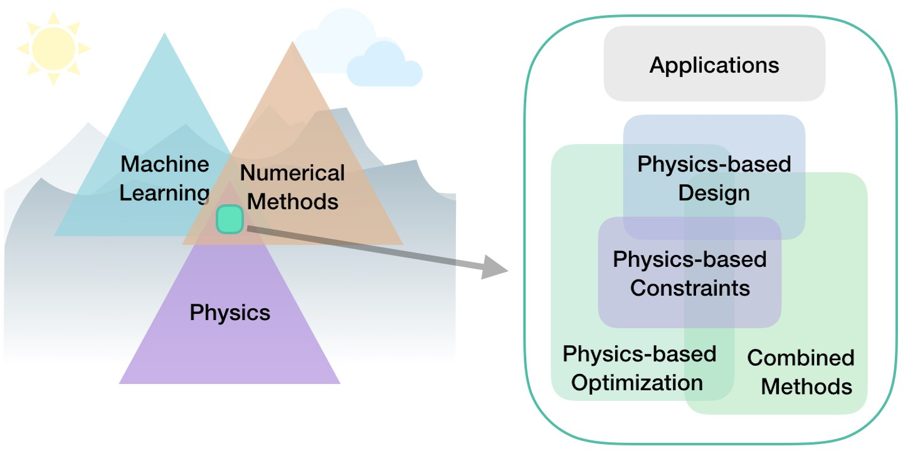
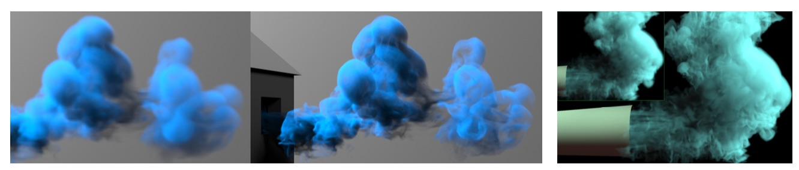
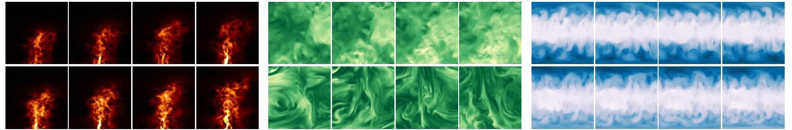

# Physics-Based Deep Learning

The following collection of materials targets _"Physics-Based Deep Learning"_
(PBDL), i.e., the field of methods with combinations of physical modeling and
deep learning (DL) techniques. Here, DL will typically refer to methods based
on artificial neural networks. The general direction of PBDL represents a very
active and quickly growing field of research. 

Within this area, we can distinguish a variety of different physics-based
approaches, from targeting designs, constraints, combined methods, and
optimizations to applications. More specifically, all approaches either target
_forward_ simulations (predicting state or temporal evolution) or _inverse_
problems (e.g., obtaining a parametrization for a physical system from
observations). 
Apart from forward or inverse, the type of integration between learning
and physics gives a means for categorizing different methods:

- _Data-driven_: the data is produced by a physical system (real or simulated),
  but no further interaction exists. 

- _Loss-terms_: the physical dynamics (or parts thereof) are encoded in the
  loss function, typically in the form of differentiable operations. The
  learning process can repeatedly evaluate the loss, and usually receives
  gradients from a PDE-based formulation.

- _Interleaved_: the full physical simulation is interleaved and combined with
  an output from a deep neural network; this requires a fully differentiable
  simulator and represents the tightest coupling between the physical system and
  the learning process. Interleaved approaches are especially important for
  temporal evolutions, where they can yield an estimate of future behavior of the
  dynamics.

Thus, methods can be roughly categorized in terms of forward versus inverse
solve, and how tightly the physical model is integrated into the
optimization loop that trains the deep neural network. Here, especially approaches
that leverage _differentiable physics_ allow for a tighter and tighter integration
of deep learning and numerical simulations.

This repository collects links to works on _deep learning algorithms for physics
problems_, with a particular emphasis on _fluid flow_, i.e., Navier-Stokes related
problems. It primarily collects links to the work of the I15 lab at TUM, as
well as miscellaneous works from other groups. This is by no means a complete
list, so let us know if you come across additional papers in this area. We
intentionally also focus on works from the _deep learning_ field, not machine
learning in general.

## I15 Physics-based Deep Learning Links

Solver-in-the-Loop: Learning from Differentiable Physics to Interact with Iterative PDE-Solvers , 
Project+Code: <https://ge.in.tum.de/publications/2020-um-solver-in-the-loop/>

Numerical investigation of minimum drag profiles in laminar flow using deep learning surrogates ,
PDF: <https://arxiv.org/abs/2009.14339>

Purely data-driven medium-range weather forecasting achieves comparable skill to physical models at similar resolution , 
PDF: <https://arxiv.org/abs/2008.08626>

Data-driven Regularization via Racecar Training for Generalizing Neural Networks , 
PDF: <https://arxiv.org/abs/2007.00024>

Latent Space Subdivision: Stable and Controllable Time Predictions for Fluid Flow , 
PDF: <https://arxiv.org/abs/2003.08723>

WeatherBench: A benchmark dataset for data-driven weather forecasting , 
Project: <https://github.com/pangeo-data/WeatherBench>

Learning Similarity Metrics for Numerical Simulations (LSiM) ,
Project+Code: <https://ge.in.tum.de/publications/2020-lsim-kohl/>

Learning to Control PDEs with Differentiable Physics , 
Project+Code: <https://ge.in.tum.de/publications/2020-iclr-holl/>

Lagrangian Fluid Simulation with Continuous Convolutions , 
PDF: <https://openreview.net/forum?id=B1lDoJSYDH>

Tranquil-Clouds: Neural Networks for Learning Temporally Coherent Features in Point Clouds , 
Project+Code: <https://ge.in.tum.de/publications/2020-iclr-prantl/>

ScalarFlow: A Large-Scale Volumetric Data Set of Real-world Scalar Transport Flows for Computer Animation and Machine Learning , 
Project+Code: <https://ge.in.tum.de/publications/2019-tog-eckert/>

tempoGAN: A Temporally Coherent, Volumetric GAN for Super-resolution Fluid Flow , 
Project+Code: <https://ge.in.tum.de/publications/tempogan/>

Deep Fluids: A Generative Network for Parameterized Fluid Simulations , 
Project+Code: <http://www.byungsoo.me/project/deep-fluids/>

Latent-space Physics: Towards Learning the Temporal Evolution of Fluid Flow , 
Project+Code: <https://ge.in.tum.de/publications/latent-space-physics/>

A Multi-Pass GAN for Fluid Flow Super-Resolution , 
PDF: <https://ge.in.tum.de/publications/2019-multi-pass-gan/>

A Study of Deep Learning Methods for Reynolds-Averaged Navier-Stokes Simulations , 
Project+Code: <https://github.com/thunil/Deep-Flow-Prediction>

Data-Driven Synthesis of Smoke Flows with CNN-based Feature Descriptors , 
Project+Code: <http://ge.in.tum.de/publications/2017-sig-chu/>

Liquid Splash Modeling with Neural Networks , 
Project+Code: <https://ge.in.tum.de/publications/2018-mlflip-um/>

Generating Liquid Simulations with Deformation-aware Neural Networks , 
Project+Code: <https://ge.in.tum.de/publications/2017-prantl-defonn/>

## Additional Links for Fluids

Using Machine Learning to Augment Coarse-Grid Computational Fluid Dynamics Simulations , 
PDF: <https://arxiv.org/pdf/2010.00072.pdf>

Learning to swim in potential flow , 
PDF: <https://arxiv.org/abs/2009.14280>

Enhanced data efficiency using deep neural networks and Gaussian processes for aerodynamic design optimization , 
PDF: <https://arxiv.org/pdf/2008.06731>

Learned discretizations for passive scalar advection in a 2-D turbulent flow ,
PDF: <https://arxiv.org/pdf/2004.05477.pdf>

Combining Differentiable PDE Solvers and Graph Neural Networks for Fluid Flow Prediction , 
PDF: <https://proceedings.icml.cc/static/paper_files/icml/2020/6414-Paper.pdf>

CFDNet: A deep learning-based accelerator for fluid simulations , 
PDF: <https://arxiv.org/pdf/2005.04485.pdf>

Controlling Rayleigh-Benard convection via Reinforcement Learning , 
PDF: <https://arxiv.org/pdf/2003.14358.pdf>

Embedding Hard Physical Constraints in Neural Network Coarse-Graining of 3D Turbulence , 
PDF: <https://arxiv.org/pdf/2002.00021.pdf>

Learning to Simulate Complex Physics with Graph Networks , 
PDF: <https://arxiv.org/abs/2002.09405>

DPM: A deep learning PDE augmentation method (with application to large-eddy simulation) , 
PDF: <https://arxiv.org/abs/1911.09145> 

Towards Physics-informed Deep Learning for Turbulent Flow Prediction , 
PDF: <https://arxiv.org/abs/1911.08655>

DeepFlow: History Matching in the Space of Deep Generative Models , 
PDF: <https://arxiv.org/abs/1905.05749>

Deep learning observables in computational fluid dynamics , 
PDF: <https://arxiv.org/pdf/1903.03040.pdf>

Compressed convolutional LSTM: An efficient deep learning framework to model high fidelity 3D turbulence , 
PDF: <https://arxiv.org/pdf/1903.00033.pdf>

Deep neural networks for data-driven LES closure models , 
PDF: <https://www.sciencedirect.com/science/article/pii/S0021999119306151>

Dynamic Upsampling of Smoke through Dictionary-based Learning , 
PDF: <https://arxiv.org/abs/1910.09166>

Deep unsupervised learning of turbulence for inflow generation at various Reynolds numbers , 
PDF: <https://arxiv.org/pdf/1908.10515.pdf>

Computing interface curvature from volume fractions: A machine learning approach , 
PDF: <https://www.sciencedirect.com/science/article/abs/pii/S0045793019302282>

Deep Neural Networks for Data-Driven Turbulence Models , 
PDF: <https://export.arxiv.org/pdf/1806.04482>

Deep Dynamical Modeling and Control of Unsteady Fluid Flows , 
PDF: <http://papers.nips.cc/paper/8138-deep-dynamical-modeling-and-control-of-unsteady-fluid-flows>

Learning Particle Dynamics for Manipulating Rigid Bodies, Deformable Objects, and Fluids , 
Project+Code: <http://dpi.csail.mit.edu>

Application of Convolutional Neural Network to Predict Airfoil Lift Coefficient , 
PDF: <https://arxiv.org/pdf/1712.10082>

Prediction of laminar vortex shedding over a cylinder using deep learning , 
PDF: <https://arxiv.org/pdf/1712.07854>

Lat-Net: Compressing Lattice Boltzmann Flow Simulations using Deep Neural Networks , 
PDF: <https://arxiv.org/pdf/1705.09036>

Reasoning About Liquids via Closed-Loop Simulation , 
PDF: <https://arxiv.org/pdf/1703.01656>

Prediction model of velocity field around circular cylinder over various Reynolds numbers by fusion convolutional neural networks based on pressure on the cylinder , 
PDF: <https://doi.org/10.1063/1.5024595>

Accelerating Eulerian Fluid Simulation With Convolutional Networks , 
Project+Code: <https://cims.nyu.edu/~schlacht/CNNFluids.htm>

Reynolds averaged turbulence modelling using deep neural networks with embedded invariance ,
PDF: <https://www.labxing.com/files/lab_publications/2259-1524535041-QiPuSd6O.pdf>

## Additional Links for General PDEs

Hierarchical Deep Learning of Multiscale Differential Equation Time-Steppers , 
PDF: <https://arxiv.org/pdf/2008.09768.pdf>

Learning Compositional Koopman Operators for Model-Based Control , 
Project: <http://koopman.csail.mit.edu>

Understanding and mitigating gradient pathologies in physics-informed neural networks , 
PDF: <https://arxiv.org/pdf/2001.04536.pdf>

Variational Physics-Informed Neural Networks For Solving Partial Differential Equations , 
PDF: <https://arxiv.org/abs/1912.00873>

Poisson CNN: Convolutional Neural Networks for the Solution of the Poisson Equation with Varying Meshes and Dirichlet Boundary Conditions , 
PDF: <https://arxiv.org/abs/1910.08613>

IDENT: Identifying Differential Equations with Numerical Time evolution , 
PDF: <https://arxiv.org/pdf/1904.03538.pdf>

Data-driven discretization: a method for systematic coarse graining of partial differential equations , 
PDF: <https://arxiv.org/pdf/1808.04930>

Neural Ordinary Differential Equations , 
PDF: <https://arxiv.org/abs/1806.07366>

PDE-Net 2.0: Learning PDEs from Data with A Numeric-Symbolic Hybrid Deep Network , 
PDF: <https://arxiv.org/pdf/1812.04426>

Deep Learning the Physics of Transport Phenomena , 
PDF: <https://arxiv.org/pdf/1709.02432>

DGM: A deep learning algorithm for solving partial differential equations , 
PDF: <https://arxiv.org/pdf/1708.07469.pdf>

Hidden Physics Models: Machine Learning of Nonlinear Partial Differential Equations , 
PDF: <https://arxiv.org/pdf/1708.00588>

Data-assisted reduced-order modeling of extreme events in complex dynamical systems , 
Project+Code: <https://github.com/zhong1wan/data-assisted>

PDE-Net: Learning PDEs from Data , 
Project+Code: <https://github.com/ZichaoLong/PDE-Net>

Learning Deep Neural Network Representations for Koopman Operators of Nonlinear Dynamical Systems , 
PDF: <https://arxiv.org/pdf/1708.06850>

## Additional Links for Other Physics Problems and Physics-related Problems

Reinforcement Learning for Molecular Design Guided by Quantum Mechanics , 
PDF: <https://proceedings.icml.cc/static/paper_files/icml/2020/1323-Paper.pdf>

Scalable Differentiable Physics for Learning and Control ,
PDF: <https://proceedings.icml.cc/static/paper_files/icml/2020/15-Paper.pdf>

Cloth in the Wind: A Case Study of Physical Measurement through Simulation , 
PDF: <https://arxiv.org/pdf/2003.05065>

Learning to Slide Unknown Objects with Differentiable Physics Simulations , 
PDF: <https://arxiv.org/pdf/2005.05456.pdf>

Physics-aware Difference Graph Networks for Sparsely-Observed Dynamics , 
Project: <https://github.com/USC-Melady/ICLR2020-PADGN>

Differentiable Molecular Simulations for Control and Learning , 
PDF: <https://arxiv.org/pdf/2003.00868.pdf>

Incorporating Symmetry into Deep Dynamics Models for Improved Generalization ,
PDF: <https://arxiv.org/pdf/2002.03061.pdf>

Learning to Measure the Static Friction Coefficient in Cloth Contact , 
PDF: <https://hal.inria.fr/hal-02511646>

Learning to Simulate Complex Physics with Graph Networks , 
PDF: <https://arxiv.org/abs/2002.09405>

Hamiltonian Neural Networks , 
PDF: <http://papers.nips.cc/paper/9672-hamiltonian-neural-networks.pdf>

Interactive Differentiable Simulation , 
PDF: <https://arxiv.org/pdf/1905.10706.pdf>

DiffTaichi: Differentiable Programming for Physical Simulation , 
PDF: <https://arxiv.org/abs/1910.00935>

COPHY: Counterfactual Learning of Physical Dynamics , 
Project: <https://github.com/fabienbaradel/cophy>

Modeling Expectation Violation in Intuitive Physics with Coarse Probabilistic Object Representations , 
Project: <http://physadept.csail.mit.edu>

End-to-End Differentiable Physics for Learning and Control , 
Project+Code: <https://github.com/locuslab/lcp-physics>

Stochastic seismic waveform inversion using generative adversarial networks as a geological prior , 
PDF: <https://arxiv.org/abs/1806.03720>

Learning to Optimize Multigrid PDE Solvers , 
PDF: <http://proceedings.mlr.press/v97/greenfeld19a/greenfeld19a.pdf>

Latent-space Dynamics for Reduced Deformable Simulation ,
Project+Code: <http://www.dgp.toronto.edu/projects/latent-space-dynamics/>

Learning-Based Animation of Clothing for Virtual Try-On ,
PDF: <http://www.gmrv.es/Publications/2019/SOC19/>

Deep Lagrangian Networks: Using Physics as Model Prior for Deep Learning , 
PDF: <https://openreview.net/pdf?id=BklHpjCqKm>

Flexible Neural Representation for Physics Prediction , 
Project+Code: <https://neuroailab.github.io/physics/>

Robust Reference Frame Extraction from Unsteady 2D Vector Fields with Convolutional Neural Networks , 
PDF: <https://arxiv.org/pdf/1903.10255.pdf>

Physics-as-Inverse-Graphics: Joint Unsupervised Learning of Objects and Physics from Video , 
PDF: <https://arxiv.org/pdf/1905.11169.pdf>

Unsupervised Intuitive Physics from Past Experiences , 
PDF: <https://arxiv.org/pdf/1905.10793.pdf>

Reasoning About Physical Interactions with Object-Oriented Prediction and Planning , 
PDF: <https://arxiv.org/pdf/1812.10972.pdf>

Neural Material: Learning Elastic Constitutive Material and Damping Models from Sparse Data , 
PDF: <https://arxiv.org/pdf/1808.04931>

Discovering physical concepts with neural networks , 
PDF: <https://arxiv.org/pdf/1807.10300.pdf>

Fluid directed rigid body control using deep reinforcement learning , 
Project: <http://gamma.cs.unc.edu/DRL_FluidRigid/>

DeepMimic, Example-Guided Deep Reinforcement Learning of Physics-Based Character Skills , 
PDF: <https://arxiv.org/pdf/1804.02717.pdf>

Unsupervised Intuitive Physics from Visual Observations , 
PDF: <https://arxiv.org/pdf/1805.05086>

Graph networks as learnable physics engines for inference and control , 
PDF: <https://arxiv.org/pdf/1806.01242.pdf>

DeepWarp: DNN-based Nonlinear Deformation , 
PDF: <https://arxiv.org/pdf/1803.09109>

A proposal on machine learning via dynamical systems , 
Journal: <https://link.springer.com/article/10.1007/s40304-017-0103-z>

Interaction Networks for Learning about Objects, Relations and Physics , 
PDF: <https://arxiv.org/pdf/1612.00222.pdf>

## Surveys and Overview Articles

Integrating Physics-Based Modeling with Machine Learning: A Survey , 
PDF: <https://arxiv.org/pdf/2003.04919>

Integrating Machine Learning with Physics-Based Modeling , 
PDF: <https://arxiv.org/abs/2006.02619>

A review on Deep Reinforcement Learning for Fluid Mechanics ,
PDF: <https://arxiv.org/pdf/1908.04127.pdf>

Machine Learning for Fluid Mechanics , 
PDF: <https://arxiv.org/pdf/1905.11075.pdf>

## Simulation and Deep Learning Frameworks

phiflow: <https://github.com/tum-pbs/phiflow>

diff-taichi: <https://github.com/yuanming-hu/difftaichi>

jax-md: <https://github.com/google/jax-md>

mantaflow: <http://mantaflow.com>

# Concluding Remarks

Physics-based deep learning is a very dynamic field. Please let us know if we've overlooked
papers that you think should be included by sending a mail to _i15ge at cs.tum.de_,
and feel free to check out our homepage at <https://ge.in.tum.de/>.
 
